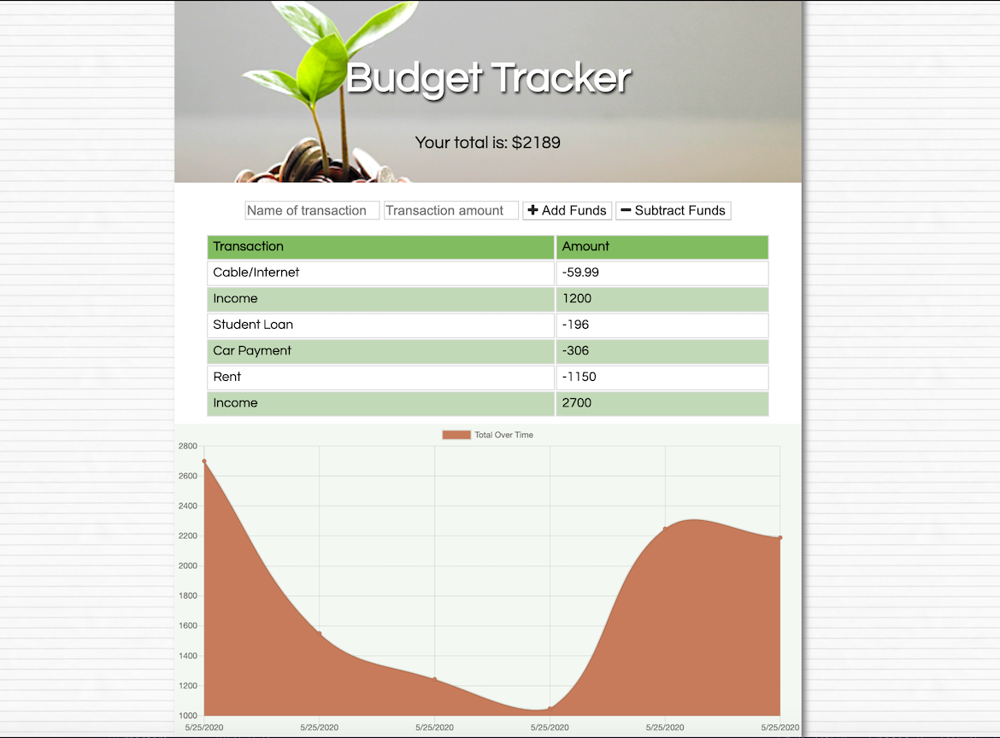
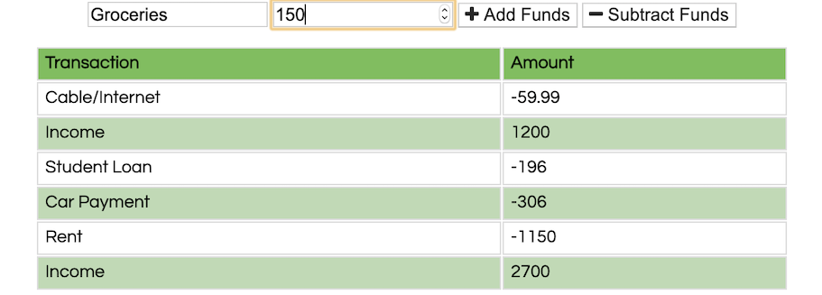

# Budget-Tracker

A budget tracking application available for online and offline use!

https://fast-ridge-93546.herokuapp.com/

## User Story

As a person who likes to save money, I want the ability to track my money, so that I can find out where my unnecessary spending lies.

## Usage

Users of the Budget Tracker have the ability to add funds, remove funds, and view all incoming and outgoing funds in chart form.

#### Main Interface

#### Add and Remove Funds

#### View your overall funds data

## Technologies Used

- Mongoose
- MongoDB
- Webpack
- Express
- Node.js
- HTML
- CSS
- Javascript

### Additional Styling Framework

- Bootstrap | https://getbootstrap.com/
- Fontsawesome icons | https://fontawesome.com/icons?d=gallery&m=free
